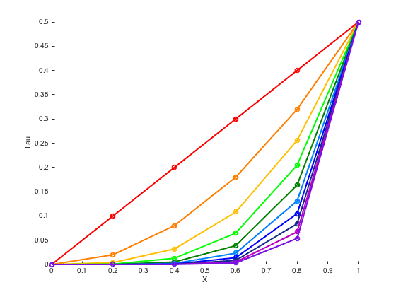
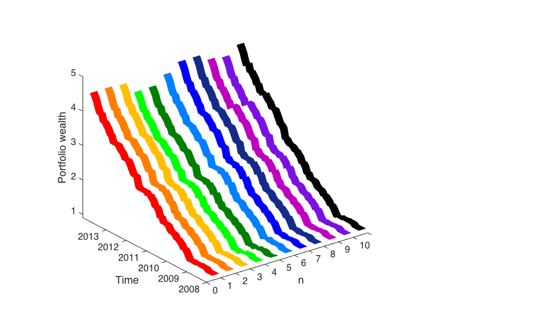

[](http://quantlet.de/index.php?p=info)

## [](http://quantlet.de/) **TEDAS_tau_spine_MF** [](http://quantlet.de/d3/ia)

```yaml

Name of Quantlet : TEDAS_tau_spine_MF

Published in : TEDAS

Description : 'Estimates the cumulative return TEDAS Naive strategy with 10 different tau-spines
for Mutual funds market based on monthly returns from Jan1998 till Dec2013'

Keywords : 'asset, index, L1-norm penalty, dynamic, portfolio, variable selection, quantile,
quantile regression, LASSO'

See also : 'TEDAS_strategies, TEDASstrategies2, TEDAS_gestalts, TEDAS_hf_acfs, TEDAS_perform,
TEDAS_tau_spine_MF, TEDAS_tau_spine_GS_KDE'

Author : Alla Petukhina

Submitted : by Alla Petukhina

Subfunction : qrRho.m

Datafile : MF_Ret.mat, MF_Tick.mat

Example: 
- Plot : "Tau-spine generation"
- Plot : "Cumulative return: Mutual funds' sample"

```





```matlab
%% Pre-loading
clc
clear
load('MF_Ret.mat')
load('MF_Tick.mat')

Date         = MFRet(1:end,1);
Date         = [Date;datenum('31-Jan-2014')];
XRET         = MFRet(1:end,2:end-2); %creating covariate and response matrices
YRET         = MFRet(1:end,end-1);

IND          = YRET;
FUNDS        = XRET;

lambda       = linspace(0.01,3,50); %grid of lambdas
wwidth       = 120; %moving window width

tau          = []; %set of quantile indices
tauall       = [];

gshift       = 0;

% Create matrix of tau-spines
a = 0.5 %
m = 5 %number of tau-spine's grids 

x = linspace(0,1,(m+1)); 

    for n=1:10
        simtau = a*(x).^n
        tauall = [tauall; simtau(:,1:end)]
    end
    


    
%% TEDAS Naive    
 
for g = 1:10
    clear cap capp cappp VaR
    cap{wwidth}  = 1; 
    capp(wwidth) = 1;
    cappp        = [];
    wshift       = 0;
    INDEX        = {};    
    NUMLAM       = [];
    lll          = [];
    ll           = [];
    TAU          = [];
    tau          = tauall(g, 2:end);
    num_digw     = 4; 
    BETA         = [];
    for l = wwidth:size(FUNDS,1)
    
        if  IND(l) > quantile(IND(1+wshift:l,:),tau(5))
            cap{l}   = sum(cell2mat(cap(l)));
            MeanRet  = mean(IND(1:l,:));
            sigma    = std(IND(1:l,:));
            skewn    = skewness(IND(1:l,:));
            kurt     = kurtosis(IND(1:l,:));
            cap{l+1} = sum(cell2mat(cap(l)).*(1 + IND(l)));
            capp     = cap{l+1}
            cappp    = [cappp,capp]
        else
            X     = XRET(1+wshift:l,:);
            Y     = YRET(1+wshift:l,:);
            [n,k] = size(X);
    
            coeff = [];
            SIC   = [];
            for j = 1:length(lambda)
    
                beta = [];
                sic  = [];
                for i = 1:length(tau)
                    c          = [tau(i).*ones(1,n),(1-tau(i)).*ones(1,n),lambda(j).*ones(1,k),zeros(1,k)];
                    A          = [eye(n),-eye(n),zeros(n,k),X];
                    A          = sparse(A);
                    B          =  [-eye(k,n),zeros(k,n),zeros(k,k),zeros(k,k); 
                                    zeros(k,n),-eye(k,n),zeros(k,k),zeros(k,k);
                                    zeros(k,n),zeros(k,n),-eye(k,k),eye(k,k);
                                    zeros(k,n),zeros(k,n),-eye(k,k),-eye(k,k)
                                    zeros(k,n),zeros(k,n),zeros(k,k),eye(k,k)];
                    B          = sparse(B);

                    q          = [zeros(1,k),zeros(1,k),zeros(1,k),zeros(1,k),zeros(1,k)]';
                    b          = Y;
                    lb         = [zeros(1,n),zeros(1,n),-Inf.*ones(1,k),-Inf.*ones(1,k)];
                    ub         = [Inf.*ones(1,n),Inf.*ones(1,n),Inf.*ones(1,k),zeros(1,k)];
                    options    = optimset('LargeScale','on','MaxIter',2000);
                    bb         = linprog(c,B,q,A,b,lb,ub,[],options);
                    bbeta      = bb(length(bb) - k + 1:end);
                    df         = length(bbeta(bbeta ~= 0));
                    qrLoss     = sum(qrRho(Y - X*bbeta,tau(i)));
                    sicc       = n*log(n^(-1)*qrLoss) + log(n)*df;
                    beta       = [beta,bbeta];
                    sic        = [sic,sicc];
                end
                coeff = [coeff,beta];
                SIC   = [SIC;sic];
            end
            sicind05    = 1:5:length(tau)*length(lambda)-4;
            sicind15    = 2:5:length(tau)*length(lambda)-3;
            sicind25    = 3:5:length(tau)*length(lambda)-2;
            sicind35    = 4:5:length(tau)*length(lambda)-1;
            sicind50    = 5:5:length(tau)*length(lambda)-0;

            beta05      = coeff(:,sicind05);
            beta15      = coeff(:,sicind15);
            beta25      = coeff(:,sicind25);
            beta35      = coeff(:,sicind35);
            beta50      = coeff(:,sicind50);

            sic05       = find(SIC(:,1) == min(SIC(:,1)));
            sic15       = find(SIC(:,2) == min(SIC(:,2)));
            sic25       = find(SIC(:,3) == min(SIC(:,3)));
            sic35       = find(SIC(:,4) == min(SIC(:,4)));
            sic50       = find(SIC(:,5) == min(SIC(:,5)));
            sicall      = [sic05, sic15, sic25, sic35, sic50];
            NUMLAM      = [NUMLAM; sicall]

            Beta05      = beta05(:,sic05);
            Beta15      = beta15(:,sic15);
            Beta25      = beta25(:,sic25);
            Beta35      = beta35(:,sic35);
            Beta50      = beta50(:,sic50);

            BetaAll     = [Beta05,Beta15,Beta25,Beta35,Beta50];

            clear XWW
            XWW = {};
            for i = 1:length(tau)
                XW = [];
                for j = 1:n
                    XWi = X(j,:).*max(abs(BetaAll(:,i)'),1/sqrt(n));
                    XW  = [XW;XWi];
                end
                XWW = [XWW,XW];
            end
    
            BetaLam = round(BetaAll.*(10^num_digw))./(10^num_digw);

            Lambda  = 0.25*sqrt(sum(abs(BetaLam) > 0))*log(k)*(log(n))^(0.1/2);
            COEFF   = [];
    
            for i = 1:length(Lambda)
                c       = [tau(i).*ones(1,n),(1-tau(i)).*ones(1,n),Lambda(i).*ones(1,k),zeros(1,k)];
                A       = [eye(n),-eye(n),zeros(n,k),XWW{i}];
                A       = sparse(A);
                B       =  [-eye(k,n),zeros(k,n),zeros(k,k),zeros(k,k); 
                             zeros(k,n),-eye(k,n),zeros(k,k),zeros(k,k);
                             zeros(k,n),zeros(k,n),-eye(k,k),eye(k,k);
                             zeros(k,n),zeros(k,n),-eye(k,k),-eye(k,k)
                             zeros(k,n),zeros(k,n),zeros(k,k),eye(k,k)];
                B       = sparse(B);
                q       = [zeros(1,k),zeros(1,k),zeros(1,k),zeros(1,k),zeros(1,k)]';
                b       = Y;
                lb      = [zeros(1,n),zeros(1,n),-Inf.*ones(1,k),-Inf.*ones(1,k)];
                ub      = [Inf.*ones(1,n),Inf.*ones(1,n),Inf.*ones(1,k),zeros(1,k)];
                options = optimset('LargeScale','on','MaxIter',2000);
                bb      = linprog(c,B,q,A,b,lb,ub,[],options);
                COE     = bb(length(bb) - k + 1:end);
                COEFF   = [COEFF,COE];   
            end

            Coeff   = COEFF.*max(abs(BetaLam),1/sqrt(n));
    
            BETAFIN = round(Coeff.*(10^num_digw))./(10^num_digw);
            
            options = optimset('Algorithm','active-set');
            
            if IND(l) <= quantile(IND(1+wshift:l,:),tau(1))
                ind     = find(BETAFIN(:,1) ~= 0);
                RetMat  = FUNDS(1:l,ind);
                wgt     = ones(1,size(RetMat,2))./size(RetMat,2);
                MeanRet = mean(RetMat)'; %calculating the mean return vector
                P       = RetMat;
                tau_i   = tau(1)
                if size(P,2) == 0
                    cap{l}   = sum(cell2mat(cap(l)));
                    cap{l+1} = cap{l};
                    capp     = cap{l+1};
                    cappp    = [cappp,capp]  
                    ll       = [ll,l]
                    wshift   = wshift + 1  
                    
                    continue                     
                end
                
                M2=cov(P);
                M3=[];
                for i=1:size(P,2)
                    S=[];
                     for j=1:size(P,2)
                        for k=1:size(P,2)
                            u=0;
                            for t=1:size(P,1) 
                                u=u+((P(t,i))*(P(t,j)) ...
                                    *(P(t,k)));
                            end
                            S(j,k)=u/(size(P,1)); 
                        end
                     end
                    M3=[M3 S];
                end
                M4=[];
                for i=1:size(P,2)
                    for j=1:size(P,2)
                        S=[];
                        for k=1:size(P,2)
                            for m=1:size(P,2)
                                u=0;
                                for t=1:size(P,1)
                                    u=u+((P(t,i))*(P(t,j))* ...
                                        (P(t,k))*(P(t,m)));
                                end
                                S(k,m)=u/(size(P,1));
                            end
                        end
                        M4=[M4 S];
                    end
                end
                cap{l} = (repmat(sum(cell2mat(cap(l)))/(length(ind)),1,length(ind))); %investing into all chosen assets with equal weights
                cap{l+1} = 0.99*sum(cell2mat(cap(l)).*(1 + FUNDS(l,ind)));
                capp     = cap{l+1};
                cappp    = [cappp,capp] 
                
            elseif IND(l) <= quantile(IND(1+wshift:l,:),tau(2))&& IND(l) > quantile(IND(1+wshift:l,:),tau(1))
                ind      = find(BETAFIN(:,2) ~= 0);
                RetMat   = FUNDS(1:l,ind);
                wgt      = ones(1,size(RetMat,2))./size(RetMat,2);
                MeanRet  = mean(RetMat)';
                P        = RetMat;
                tau_i   =tau(2)
                
                if size(P,2) == 0
                    cap{l}   = sum(cell2mat(cap(l)));
                    cap{l+1} = cap{l};
                    capp     = cap{l+1};
                    cappp    = [cappp,capp] 
                    wshift   = wshift + 1  
                    ll       = [ll,l]
                    continue                     
                end
                
                M2=cov(P);
                M3=[];
                for i=1:size(P,2)
                    S=[];
                     for j=1:size(P,2)
                        for k=1:size(P,2)
                            u=0;
                            for t=1:size(P,1) 
                                u=u+((P(t,i))*(P(t,j)) ...
                                    *(P(t,k)));
                            end
                            S(j,k)=u/(size(P,1)); 
                        end
                     end
                    M3=[M3 S];
                end
                M4=[];
                for i=1:size(P,2)
                    for j=1:size(P,2)
                        S=[];
                        for k=1:size(P,2)
                            for m=1:size(P,2)
                                u=0;
                                for t=1:size(P,1)
                                    u=u+((P(t,i))*(P(t,j))* ...
                                        (P(t,k))*(P(t,m)));
                                end
                                S(k,m)=u/(size(P,1));
                            end
                        end
                        M4=[M4 S];
                    end
                end
                cap{l}   = (repmat(sum(cell2mat(cap(l)))/(length(ind)),1,...
                           length(ind)));

                cap{l+1} = 0.99*sum(cell2mat(cap(l)).*(1 + FUNDS(l,ind)));
                capp     = cap{l+1};
                cappp    = [cappp,capp] 
            elseif IND(l) <= quantile(IND(1+wshift:l,:),tau(3))&& IND(l)...  
                          >  quantile(IND(1+wshift:l,:),tau(2))%
                ind     = find(BETAFIN(:,3) ~= 0);
                RetMat  = FUNDS(1:l,ind);
                wgt     = ones(1,size(RetMat,2))./size(RetMat,2);
                MeanRet = mean(RetMat)';
                P       = RetMat;
                tau_i   =tau(3)
                
                if size(P,2) == 0
                    cap{l}   = sum(cell2mat(cap(l)));                   
                    cap{l+1} = cap{l};
                    capp     = cap{l+1};
                    cappp    = [cappp,capp] 
                    wshift   = wshift + 1  
                    ll       = [ll,l]
                    continue                     
                end
                
                M2=cov(P);
                M3=[];
                for i=1:size(P,2)
                    S=[];
                     for j=1:size(P,2)
                        for k=1:size(P,2)
                            u=0;
                            for t=1:size(P,1) 
                                u=u+((P(t,i))*(P(t,j)) ...
                                    *(P(t,k)));
                            end
                            S(j,k)=u/(size(P,1)); 
                        end
                     end
                    M3=[M3 S];
                end
                M4=[];
                for i=1:size(P,2)
                    for j=1:size(P,2)
                        S=[];
                        for k=1:size(P,2)
                            for m=1:size(P,2)
                                u=0;
                                for t=1:size(P,1)
                                    u=u+((P(t,i))*(P(t,j))* ...
                                        (P(t,k))*(P(t,m)));
                                end
                                S(k,m)=u/(size(P,1));
                            end
                        end
                        M4=[M4 S];
                    end
                end
                cap{l}   = (repmat(sum(cell2mat(cap(l)))/(length(ind)),1,...
                           length(ind)));
                cap{l+1} = 0.99*sum(cell2mat(cap(l)).*(1 + FUNDS(l,ind)));
                capp     = cap{l+1};
                cappp    = [cappp,capp] 
           elseif IND(l) <= quantile(IND(1+wshift:l,:),tau(4))&& IND(l) ...
                         >  quantile(IND(1+wshift:l,:),tau(3))
                ind      = find(BETAFIN(:,4) ~= 0);
                RetMat   = FUNDS(1:l,ind);
                wgt      = ones(1,size(RetMat,2))./size(RetMat,2);
                MeanRet  = mean(RetMat)';
                P        = RetMat;
                tau_i    = tau(4)
                
                if size(P,2) == 0
                    cap{l}   = sum(cell2mat(cap(l)));
                    cap{l+1} = cap{l};
                    capp     = cap{l+1};
                    cappp    = [cappp,capp] 
                    wshift   = wshift + 1  
                    ll       = [ll,l]
                    continue                     
                end
                
                M2=cov(P);
                M3=[];
                for i=1:size(P,2)
                    S=[];
                     for j=1:size(P,2)
                        for k=1:size(P,2)
                            u=0;
                            for t=1:size(P,1) 
                                u=u+((P(t,i))*(P(t,j)) ...
                                    *(P(t,k)));
                            end
                            S(j,k)=u/(size(P,1)); 
                        end
                     end
                    M3=[M3 S];
                end
                M4=[];
                for i=1:size(P,2)
                    for j=1:size(P,2)
                        S=[];
                        for k=1:size(P,2)
                            for m=1:size(P,2)
                                u=0;
                                for t=1:size(P,1)
                                    u=u+((P(t,i))*(P(t,j))* ...
                                        (P(t,k))*(P(t,m)));
                                end
                                S(k,m)=u/(size(P,1));
                            end
                        end
                        M4=[M4 S];
                    end
                end
                cap{l}   = (repmat(sum(cell2mat(cap(l)))/(length(ind)),1,...
                           length(ind)));
                cap{l+1} = 0.99*sum(cell2mat(cap(l)).*(1 + FUNDS(l,ind)));
                capp     = cap{l+1};
                cappp    = [cappp,capp]
            else
                ind      = find(BETAFIN(:,5) ~= 0);
                RetMat   = FUNDS(1:l,ind);                            
                wgt      = ones(1,size(RetMat,2))./size(RetMat,2);
                MeanRet  = mean(RetMat)';
                P        = RetMat;
                tau_i    = tau(5)
                
                if size(P,2) == 0
                    cap{l}   = sum(cell2mat(cap(l)));                 
                    cap{l+1} = cap{l};
                    capp     = cap{l+1};
                    cappp    = [cappp,capp] 
                    wshift   = wshift + 1  
                    ll       = [ll,l]
                    continue                     
                end
                
                M2=cov(P);
                M3=[];
                for i=1:size(P,2)
                    S=[];
                     for j=1:size(P,2)
                        for k=1:size(P,2)
                            u=0;
                            for t=1:size(P,1) 
                                u=u+((P(t,i))*(P(t,j)) ...
                                    *(P(t,k)));
                            end
                            S(j,k)=u/(size(P,1)); 
                        end
                     end
                    M3=[M3 S];
                end
                M4=[];
                for i=1:size(P,2)
                    for j=1:size(P,2)
                        S=[];
                        for k=1:size(P,2)
                            for m=1:size(P,2)
                                u=0;
                                for t=1:size(P,1)
                                    u=u+((P(t,i))*(P(t,j))* ...
                                        (P(t,k))*(P(t,m)));
                                end
                                S(k,m)=u/(size(P,1));
                            end
                        end
                        M4=[M4 S];
                    end
                end
                cap{l}   = (repmat(sum(cell2mat(cap(l)))/(length(ind)),1,...
                           length(ind)));
                cap{l+1} = 0.99*sum(cell2mat(cap(l)).*(1 + FUNDS(l,ind)));
                capp     = cap{l+1};
                cappp    = [cappp,capp]        
            end
            BETA      = [BETA,BETAFIN];
            lll       = [lll,l];
            INDEX{g}  = ind;
            TAU       = [TAU, tau_i]; 
            wshift = wshift + 1
            
        end
   
    
    end
    
    TAUSPINE(g).TAULEV = tau;        % Tau-spine grids
    TAUSPINE(g).lll    = lll;        % indeces for days TEDAS portfolio rebalancing 
    TAUSPINE(g).ll     = ll;         % indeces for days stay-in-cash rebalancing 
    TAUSPINE(g).CAPN   = [1, cappp]; % final cumulative return vector for TEDAS Naive
    TAUSPINE(g).TAU    = TAU;        % vector of probability levels on every moving window
    TAUSPINE(g).INDEX  = INDEX;      % matrix of stocks indeces for portfolio constrruction
    TAUSPINE(g).BETA   = BETA;       % matrix of ALQR beta-coefficients
    TAUSPINE(g).NUMLAM = NUMLAM;     % lambdas' vector
    
    gshift    = gshift + 1  
end

 
%% S&P BUY-AND-HOLD
clear INDCAPIT INDCAP INDCAPIT2 INDCAP2
INDCAP(wwidth) = 1;
INDCAPIT       = [];
ishift         = 0;
VaRI           = [];
for i = wwidth:size(IND,1)
    
    MeanRet     = mean(IND(1:i,:));
    sigma       = std(IND(1:i,:));
    skewn       = skewness(IND(1:i,:));
    kurt        = kurtosis(IND(1:i,:));
    
    INDCAP(i+1) = INDCAP(i)*(1+IND(i));
    indcaplast  = INDCAP(i+1);
    INDCAPIT    = [INDCAPIT,indcaplast];    
    VaRI        = [VaRI,VaR];
    ishift      = ishift + 1
end

INDCAPITST = [1,INDCAPIT]; %final cumulative return vector for Strategy 2

%% Plots
% 3 D plot for MF cum returns 
% Create a rainbow-colors matrix

color1  = [1 0 0];
color2  = [1 0.494117647409439 0];
color3  = [1 0.749019622802734 0];
color4  = [0 1 0];
color5  = [0 0.498039215803146 0];
color6  = [0 0.498039215803146 1];
color7  = [0 0 1];
color8  = [0.0784313753247261 0.168627455830574 0.549019634723663];
color9  = [0.749019622802734 0 0.749019622802734];
color10 = [0.47843137383461 0.062745101749897 0.894117653369904];
Rainbow = [color1; color2; color3; color4; color5; color6; color7; ...
          color8; color9; color10];


surf([1:74], [1 2],     TAUSPINE(1).CAPN([1 1], :), 'LineStyle','none', 'FaceColor', color1)
axis([0 74 0 22 0.9 5])
hold on
surf([1:74], [3 4],   TAUSPINE(2).CAPN([1 1], :),  'LineStyle', 'none',  'FaceColor',color2)
surf([1:74], [5 6],   TAUSPINE(3).CAPN([1 1], :),  'LineStyle', 'none',   'FaceColor',color3)
surf([1:74], [7 8],   TAUSPINE(4).CAPN([1 1], :),  'LineStyle', 'none',  'FaceColor',color4)
surf([1:74], [9 10],  TAUSPINE(5).CAPN([1 1], :),  'LineStyle', 'none',  'FaceColor',color5)
surf([1:74], [11 12], TAUSPINE(6).CAPN([1 1], :),  'LineStyle', 'none',  'FaceColor',color6)
surf([1:74], [13 14], TAUSPINE(7).CAPN([1 1], :),  'LineStyle', 'none',   'FaceColor',color7)
surf([1:74], [15 16], TAUSPINE(8).CAPN([1 1], :),  'LineStyle', 'none',   'FaceColor',color8)
surf([1:74], [17 18], TAUSPINE(9).CAPN([1 1], :),  'LineStyle', 'none',  'FaceColor',color9)
surf([1:74], [19 20], TAUSPINE(10).CAPN([1 1], :), 'LineStyle', 'none',  'FaceColor',color10)
surf([1:74], [21 22], INDCAPITST ([1 1], :),       'LineStyle', 'none',  'FaceColor',[0 0 0])
hold off


   % Plot of tau-spines

lineThick = 2;


figure 
set(gca, 'ColorOrder', Rainbow);
hold all 
plot(x(1:end),tauall,'Marker','o', 'LineWidth',lineThick)

xlabel('X'), ylabel('Tau'); 
   


  
  
```
